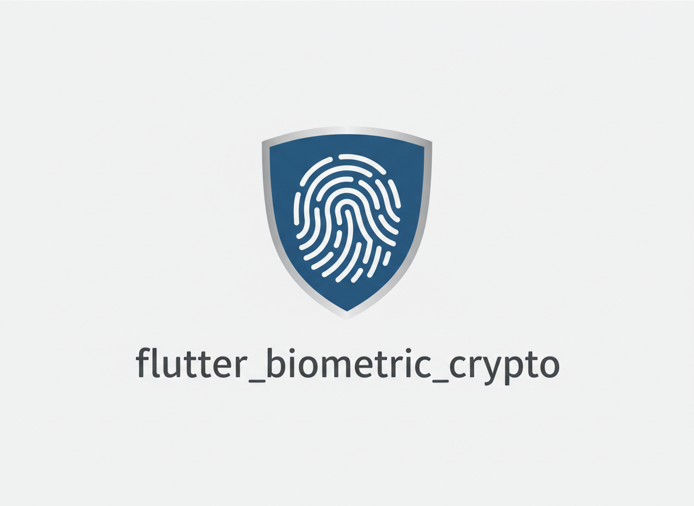
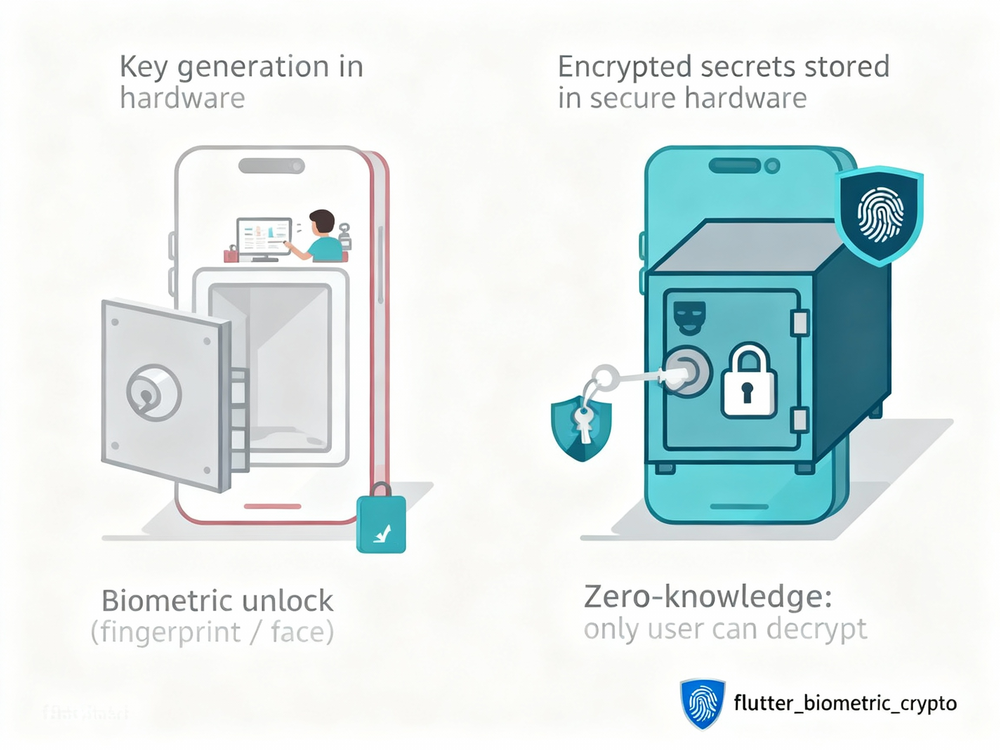

<p align="center">
  
</p>

# flutter_biometric_crypto

> **Enterprise-grade biometric-protected encryption for Flutter apps**

[](https://pub.dev/packages/flutter_biometric_crypto)
[](https://opensource.org/licenses/MIT)

Protect your app's sensitive data with hardware-backed security. `flutter_biometric_crypto` provides a simple, secure way to encrypt small secrets (like API keys, tokens, or passwords) using your device's biometric authentication and secure hardware storage.

---

## ✨ Why Choose This Package?

In today's security-conscious world, protecting user data is paramount. This package bridges the gap between convenience and security.

<p align="center">
  
</p>

### Key Features

- **🛡️ Hardware-Backed Security**: Your private keys never leave the device's secure hardware (Android Keystore or iOS Secure Enclave).
- **👆 Seamless User Experience**: Users authenticate with their fingerprint or face—no passwords to remember.
- **🔒 Zero-Knowledge Architecture**: Even you as the developer can't access the encrypted data without user authentication.
- **⚡ Production Ready**: Battle-tested with comprehensive error handling and security best practices.

Perfect for storing authentication tokens, API keys, payment credentials, or any sensitive data that needs an extra layer of protection.

## 🚀 Quick Start

### Installation

Add `flutter_biometric_crypto` to your `pubspec.yaml`:

```yaml
dependencies:
  flutter_biometric_crypto: ^0.1.2
```

Then run:

```bash
flutter pub get
```

### Basic Usage

```dart
import 'package:flutter_biometric_crypto/flutter_biometric_crypto.dart';
import 'dart:typed_data';

// 1. Initialize the key (one-time setup)
await FlutterBiometricCrypto.initKey();

// 2. Check if biometric is available
final isAvailable = await FlutterBiometricCrypto.isBiometricAvailable();
if (!isAvailable) {
  // Handle gracefully - show alternative authentication
  return;
}

// 3. Encrypt your sensitive data
final sensitiveData = Uint8List.fromList('MySecretAPIKey123'.codeUnits);
final encrypted = await FlutterBiometricCrypto.encrypt(sensitiveData);

// 4. Decrypt when needed (prompts for biometric)
final decrypted = await FlutterBiometricCrypto.decrypt(encrypted);
final decryptedText = String.fromCharCodes(decrypted);
print(decryptedText); // Output: MySecretAPIKey123
```

That's it! Your data is now protected by biometric authentication and secure hardware storage.

## 📱 Platform Setup

### Android

1. **Set Minimum SDK Version** (API 23+ required)

Add to `android/app/build.gradle`:

```gradle
android {
    defaultConfig {
        minSdkVersion 23  // Android 6.0+
    }
}
```

2. **Add Biometric Dependency** (Included automatically, but ensure conflicts don't exist)

The plugin uses `androidx.biometric:biometric:1.1.0`.

3. **Permissions** (automatically included)

The plugin automatically includes required permissions:
- `USE_BIOMETRIC`
- `USE_FINGERPRINT`

### iOS

1. **Minimum iOS Version**: iOS 12.0 or higher

2. **Add Face ID Usage Description**

Add to `ios/Runner/Info.plist`:

```xml
<key>NSFaceIDUsageDescription</key>
<string>This app uses Face ID to securely authenticate and decrypt your encrypted data.</string>
```

3. **Keychain Access** (automatic)

The plugin uses iOS Keychain which is available by default. For devices with Secure Enclave, keys are automatically stored there for maximum security.

## 💡 Real-World Examples

### Storing an API Token

```dart
// Encrypt and store API token
final apiToken = 'eyJhbGciOiJIUzI1NiIsInR5cCI6IkpXVCJ9...';
final tokenBytes = Uint8List.fromList(apiToken.codeUnits);
final encryptedToken = await FlutterBiometricCrypto.encrypt(tokenBytes);

// Store encryptedToken in your app's secure storage
await secureStorage.write(key: 'api_token', value: base64Encode(encryptedToken));

// Later, retrieve and decrypt
final storedEncrypted = base64Decode(await secureStorage.read(key: 'api_token'));
final decryptedToken = await FlutterBiometricCrypto.decrypt(storedEncrypted);
final token = String.fromCharCodes(decryptedToken);
```

### Protecting User Credentials

```dart
// Encrypt user password before storing
final password = 'userPassword123';
final passwordBytes = Uint8List.fromList(password.codeUnits);
final encryptedPassword = await FlutterBiometricCrypto.encrypt(passwordBytes);

// Store encrypted password
// ... later decrypt when user needs to authenticate
```

## 🛠️ API Reference

### `initKey()`

Generates a new RSA 2048 key pair if one doesn't exist. Safe to call multiple times—it won't create duplicate keys.

```dart
await FlutterBiometricCrypto.initKey();
```

**When to call**: Once during app initialization or before first use.

### `encrypt(Uint8List data)`

Encrypts data using the public key. No authentication required.

```dart
final encrypted = await FlutterBiometricCrypto.encrypt(data);
```

**Parameters**:
- `data`: Data to encrypt (max 1 KB / 1024 bytes)

**Returns**: `Future<Uint8List>` - Encrypted data

**Throws**:
- `DataTooLargeException` - Data exceeds 1 KB limit
- `KeyNotFoundException` - Key not initialized (call `initKey()` first)
- `EncryptionException` - Encryption operation failed

### `decrypt(Uint8List encrypted)`

Decrypts data using the private key. **Requires biometric authentication**.

```dart
final decrypted = await FlutterBiometricCrypto.decrypt(encrypted);
```

**Parameters**:
- `encrypted`: Previously encrypted data

**Returns**: `Future<Uint8List>` - Decrypted data

**Throws**:
- `BiometricNotAvailableException` - No biometric sensor or not enrolled
- `BiometricAuthenticationFailedException` - User failed or cancelled authentication
- `KeyNotFoundException` - Key not initialized
- `DecryptionException` - Decryption operation failed

### `isBiometricAvailable()`

Checks if biometric authentication is available and properly configured.

```dart
final available = await FlutterBiometricCrypto.isBiometricAvailable();
if (available) {
  // Proceed with biometric-protected operations
}
```

**Returns**: `Future<bool>` - `true` if biometric is ready to use

### `deleteKey()`

Permanently removes the key pair from secure storage. Use with caution!

```dart
await FlutterBiometricCrypto.deleteKey();
```

**Note**: After deletion, you'll need to call `initKey()` again before encrypting/decrypting.

## ⚠️ Error Handling

Always handle exceptions gracefully:

```dart
try {
  final encrypted = await FlutterBiometricCrypto.encrypt(data);
  // Success!
} on DataTooLargeException catch (e) {
  // Data is too large - consider splitting or using hybrid encryption
  print('Error: ${e.message}');
} on KeyNotFoundException catch (e) {
  // Initialize key first
  await FlutterBiometricCrypto.initKey();
  // Retry encryption
} on EncryptionException catch (e) {
  // Handle encryption failure
  print('Encryption failed: ${e.message}');
}

try {
  final decrypted = await FlutterBiometricCrypto.decrypt(encrypted);
  // Success!
} on BiometricNotAvailableException catch (e) {
  // No biometric available - show alternative authentication method
  showAlternativeAuth();
} on BiometricAuthenticationFailedException catch (e) {
  // User failed authentication or cancelled
  showError('Authentication failed. Please try again.');
} on DecryptionException catch (e) {
  // Handle decryption failure
  print('Decryption failed: ${e.message}');
}
```

## 🔒 Security Best Practices

1. **Always Check Biometric Availability**
   ```dart
   if (!await FlutterBiometricCrypto.isBiometricAvailable()) {
     // Provide fallback authentication method
   }
   ```

2. **Handle Errors Securely**
   - Never log sensitive data or encryption keys
   - Don't expose error details to end users
   - Log errors for debugging but sanitize sensitive information

3. **Key Management**
   - Call `initKey()` during app initialization
   - Only delete keys when user explicitly requests account deletion
   - Never extract or share private keys

4. **Data Size Considerations**
   - Maximum 1 KB per encryption operation
   - For larger data, use hybrid encryption:
     - Generate a symmetric key (AES)
     - Encrypt the symmetric key with this package
     - Encrypt your data with the symmetric key

## 📊 Limitations & Considerations

### Data Size Limit

**Maximum**: 1 KB (1024 bytes) per encryption operation.

**Why?** RSA encryption is designed for small data. For larger payloads, use hybrid encryption (encrypt a symmetric key with this package, then use AES for your data).

### Platform Support

- ✅ **Android**: API 23+ (Android 6.0+)
- ✅ **iOS**: 12.0+
- ❌ Web, macOS, Windows, Linux (not supported)

### Biometric Requirements

- **Android**: Requires fingerprint sensor or face unlock
- **iOS**: Requires Face ID or Touch ID enrollment
- **Fallback**: iOS may fall back to device passcode if biometric fails

### Key Persistence

Keys are stored in platform-specific secure storage:
- **Lost if**: App is uninstalled or app data is cleared
- **Persists**: Across app updates and device restarts
- **Not synced**: Keys are device-specific and never leave the device

## 🧪 Testing

### Unit Tests

```bash
flutter test
```

### Integration Tests

Requires a real device or emulator with biometric support:

```bash
flutter test integration_test/flutter_biometric_crypto_test.dart
```

**Note**: 
- Android emulators: Configure fingerprint in Settings > Security
- iOS simulators: Use Hardware > Face ID > Enrolled

## 📱 Example App

A complete example app demonstrating all features is available in the `example/` directory.

```bash
cd example
flutter run
```

The example app includes:
- Key initialization
- Biometric availability checking
- Encryption/decryption workflow
- Error handling examples
- UI for testing all features

## 🐛 Troubleshooting

### "Biometric not available" on Android

- ✅ Ensure device has fingerprint sensor or face unlock
- ✅ Set up biometric authentication in device Settings
- ✅ Verify `minSdkVersion` is 23 or higher
- ✅ Check that `androidx.biometric:biometric:1.1.0` is in dependencies

### "Biometric not available" on iOS

- ✅ Ensure Face ID or Touch ID is set up on device
- ✅ Verify `NSFaceIDUsageDescription` is in `Info.plist`
- ✅ Check app entitlements in Xcode

### "Key not found" error

- ✅ Call `initKey()` before first use
- ✅ Ensure app has proper permissions
- ✅ On Android, verify device supports Android Keystore

### Decryption fails immediately

- ✅ Check `isBiometricAvailable()` first
- ✅ Ensure user has enrolled biometrics
- ✅ Verify key was initialized successfully

## 👨‍💻 Author

**Godfrey Lebo** - Fullstack Developer & Technical PM

> With **9+ years of industry experience**, I specialize in building AI-powered applications, scalable mobile solutions, and secure backend systems. I've led teams delivering marketplaces, fintech platforms, and AI applications serving thousands of users.

- 📧 **Email**: [emorylebo@gmail.com](mailto:emorylebo@gmail.com)
- 💼 **LinkedIn**: [godfreylebo](https://www.linkedin.com/in/godfreylebo/)
- 🌐 **Portfolio**: [godfreylebo.dev](https://www.godfreylebo.dev/)
- 🐙 **GitHub**: [@emorilebo](https://github.com/emorilebo)

## 🤝 Contributing

Contributions are welcome! Whether it's:
- 🐛 Bug reports
- 💡 Feature suggestions
- 📝 Documentation improvements
- 🔧 Code contributions

Please feel free to open an issue or submit a pull request.

## 📄 License

This project is licensed under the MIT License - see the [LICENSE](LICENSE) file for details.

## 📚 Additional Resources

- [CHANGELOG.md](CHANGELOG.md) - Version history and updates
- [GitHub Repository](https://github.com/emorilebo/flutter_biometric_crypto) - Source code and issues

---

**Made with ❤️ by [Godfrey Lebo](https://www.godfreylebo.dev/)**

If this package helps secure your app, consider giving it a ⭐ on GitHub!
